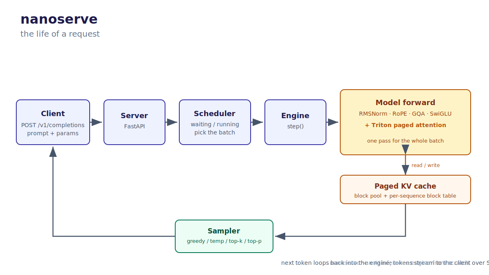
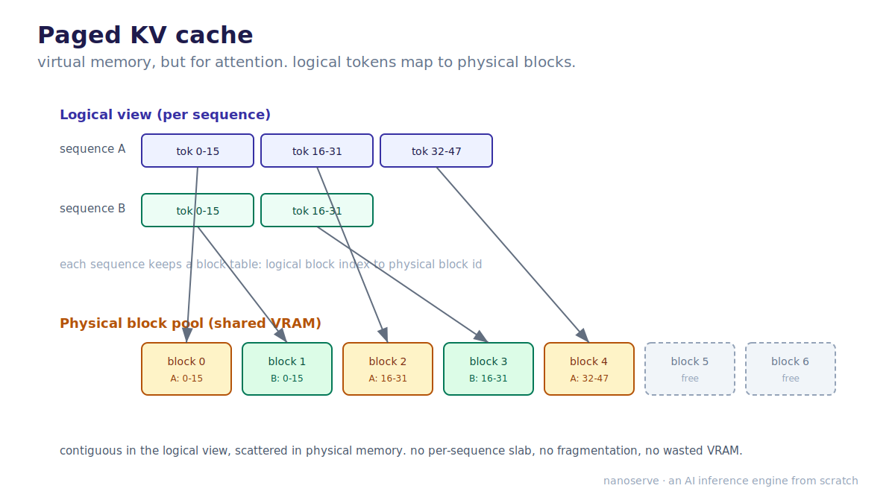
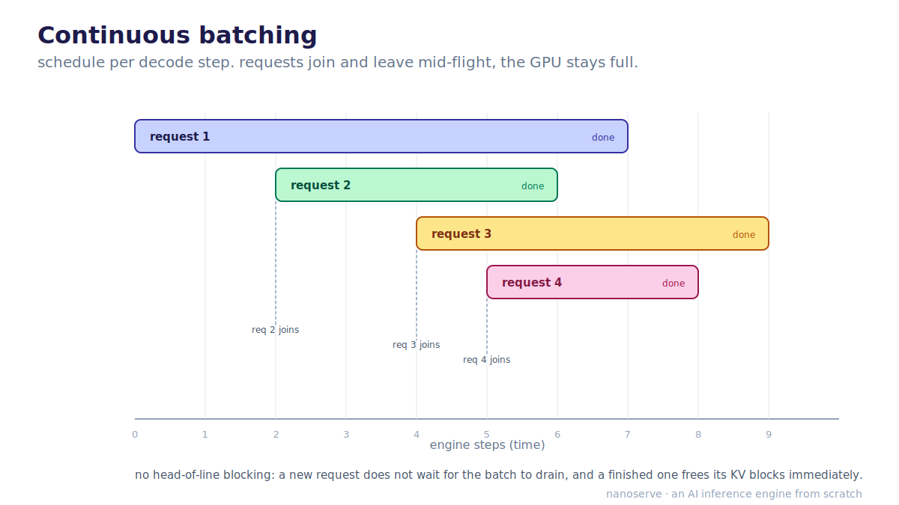

# nanoserve

**A from-scratch LLM inference engine you can read in an afternoon.** Think nanoGPT, but for serving instead of training.

<p align="center">
  
</p>

Production inference engines like vLLM and SGLang are 100k+ lines. The ideas that make them fast (paged attention, continuous batching, iteration-level scheduling) are buried under that scale. nanoserve implements those same ideas in the smallest code that still does the real work: roughly 1.5k to 2k annotated lines, built and posted in public over 100 days.

The rule of the build is **correctness before speed**. Every numerical piece is checked against the HuggingFace reference to 1e-5 before anything is optimized. The first thing built was not a model, it was the test harness that proves the model right.

## Status

**Day 7 of 100 (Week 1 done).** Every forward-pass primitive is built and a full transformer block is assembled from them, each verified against the real Llama-3.2-1B.

| Stage | Verified against HuggingFace | Status |
| --- | --- | --- |
| Weight loading (safetensors name mapping) | tensor inventory + shapes | done |
| RMSNorm | `input_layernorm` hook, to 1e-5 | done |
| RoPE (inv_freq, cos/sin table, rotate-half apply) | `rotary_emb` + `apply_rotary_pos_emb`, 1e-6 to 1e-9 | done |
| SwiGLU MLP | `mlp` hook, to 1e-5 | done |
| GQA attention (32 query / 8 KV heads, causal prefill) | `self_attn` hook, to 1e-5 | done |
| Full transformer block (pre-norm, two residuals) | `model.layers[0]` hook, to 1e-5 | done |
| Full forward pass + greedy decode | token-for-token | next (Week 2: stack the blocks) |
| Sampling, paged KV cache, Triton kernel, scheduler, OpenAI server | | roadmap below |

Daily build log: [docs/daily/](docs/daily/). Full 100-day plan: [docs/PLAN.md](docs/PLAN.md).

## Quickstart

The pure-math correctness tests run with no GPU and no model weights:

```bash
git clone https://github.com/pjdurden/nanoserve
cd nanoserve
python -m venv .venv && source .venv/bin/activate
pip install -e ".[dev]"
pytest
```

To run the **full** verification against the real Llama-3.2-1B, download the weights first (it is a gated repo: accept the license on the model page, then authenticate). The HuggingFace-comparison tests skip cleanly until the weights are present, then run automatically:

```bash
huggingface-cli login        # or: export HF_TOKEN=...
python scripts/download_weights.py   # lands in ./weights (gitignored)
pytest                               # HF-comparison tests now run too
```

## How it is verified

The whole project is built around one idea: a piece of an inference engine is only done when it matches a known-correct reference, bit for bit. The harness in [tests/reference.py](tests/reference.py) loads Llama-3.2-1B once (fp32, CPU) and captures intermediate activations with forward hooks, so every component can assert its own tensor against the matching HuggingFace activation.

Tests come in two tiers:

- **Pure-math tests** run anywhere (torch only): the RMSNorm formula, the rotate-half convention pinned to `transformers`' own `apply_rotary_pos_emb`, the SwiGLU definition, an independent attention recompute, plus *trap tests* that deliberately swap branches, scramble KV-head grouping, or poke a future token and assert the answer changes (or, for the causal mask, does not), so a future refactor that breaks them fails loudly.
- **Reference tests** compare to the real model: RMSNorm against the `input_layernorm` hook, RoPE against the model's own rotary buffers, SwiGLU against the `mlp` hook, GQA attention against the `self_attn` hook, all to 1e-5 or tighter.

The test that matters is not "do the names match." It is "did the right bytes land under the right name." That is the only thing that catches a swapped q and k.

## Architecture

A request comes in over HTTP, the scheduler decides which requests run this step, the model does one forward pass for the whole batch reading and writing a paged KV cache, a sampler picks the next token per sequence, and finished or streamed tokens go back out. That loop is the engine. The diagram at the top of this README traces it end to end.

Full write-up with diagrams: [docs/ARCHITECTURE.md](docs/ARCHITECTURE.md).

### The two ideas that make it an engine

Everything else is standard transformer code. These two are why an inference engine is its own thing.

1. **Paged KV cache.** A naive cache reserves one contiguous slab per sequence sized for the maximum length, so most VRAM sits empty. A paged cache splits KV memory into fixed-size physical blocks in a shared pool and gives each sequence a block table mapping logical positions to physical blocks. Same trick as virtual memory in an OS.
2. **Continuous batching.** Static batching waits for a whole batch to finish before starting the next, so one long request stalls everyone behind it. Continuous batching schedules at the granularity of a single decode step: every step it admits newly arrived requests and retires finished ones, keeping the GPU full.

<p align="center">
  
  
</p>

## Roadmap

**v1 (by Day 100):** load Llama-3.2-1B from safetensors into hand-written layers; generate text that matches HuggingFace token-for-token under greedy decoding; temperature / top-k / top-p sampling; a paged KV cache with a block allocator; a hand-written Triton paged-attention kernel; continuous batching with preemption; an OpenAI-compatible `/v1/completions` endpoint with SSE streaming.

**Out of scope for v1 (the v2 teaser):** speculative decoding, tensor parallelism, prefix caching, quantization. v1 stops at a correct, batched, served engine.

## Repo layout

```
src/nanoserve/
  config.py        model config + names
  loader.py        safetensors -> tensors
  layers.py        RMSNorm, RoPE, attention, SwiGLU
  model.py         the transformer, forward pass
  cache.py         paged KV cache + block allocator
  kernels/         Triton paged-attention kernel
  sampling.py      greedy, temperature, top-k, top-p
  scheduler.py     waiting/running queues, continuous batching
  engine.py        ties model + cache + scheduler together
  server.py        FastAPI, OpenAI-compatible endpoint
```

## Target hardware

One small GPU (a single 4090 or A10 is plenty for a 1B model). Logic is developed against the HuggingFace reference on CPU; performance numbers are taken on the GPU.

## License

MIT.
