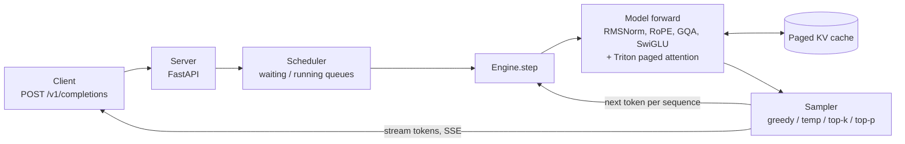
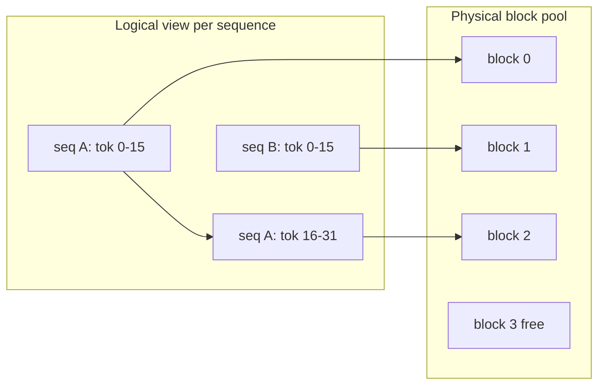

# nanoserve architecture

What gets built, how the pieces fit, and the order they arrive in. Diagrams render on GitHub (mermaid). The same diagrams exist as SVGs in [diagrams/](diagrams/) for export to LinkedIn (see [docs/README.md](README.md) for how to turn an SVG into a PNG).

## The one-sentence version

A request comes in over HTTP, the scheduler decides which requests run this step, the model does one forward pass for the whole batch reading and writing a paged KV cache, a sampler picks the next token for each sequence, and finished or streamed tokens go back out. That loop is the engine.

## The life of a request

## Components

| Module | Job | Built in |
| --- | --- | --- |
| `config.py` | model shapes and hyperparameters for Llama-3.2-1B | Week 1 |
| `loader.py` | map safetensors weights into nanoserve layers | Week 1 |
| `layers.py` | RMSNorm, RoPE, GQA attention, SwiGLU | Weeks 1-2 |
| `model.py` | stack the blocks, forward to logits | Week 2 |
| `sampling.py` | turn logits into a token id | Week 3 |
| `cache.py` | naive cache, then paged cache + block allocator | Weeks 3-5 |
| `kernels/paged_attention.py` | the Triton kernel that reads KV through the block table | Week 6 |
| `scheduler.py` | static then continuous batching, preemption | Weeks 7-9 |
| `engine.py` | the run loop tying model + cache + scheduler together | Weeks 5-9 |
| `server.py` | OpenAI-compatible HTTP endpoint, SSE streaming | Weeks 10-11 |

## The two ideas that matter

Everything else is standard transformer code. These two are why an inference engine is its own thing.

### 1. Paged KV cache

A naive KV cache reserves one contiguous slab per sequence sized for the maximum length, so most of the VRAM sits empty waiting for tokens that may never come. A paged cache splits KV memory into fixed-size physical blocks in a shared pool, and gives each sequence a block table that maps its logical token positions to whichever physical blocks it was handed. Same trick as virtual memory in an operating system.

### 2. Continuous batching

Static batching waits for a whole batch to finish before starting the next, so one long request stalls everyone behind it (head-of-line blocking). Continuous batching schedules at the granularity of a single decode step: every step the scheduler can admit newly arrived requests into the running batch and retire finished ones, so the GPU stays full and short requests are not held hostage by long ones.

```mermaid
gantt
    title Continuous batching: requests join and leave mid-flight
    dateFormat X
    axisFormat %s
    section GPU steps
    req 1 (prefill + decode) :0, 7
    req 2 (joins at step 2)  :2, 6
    req 3 (joins at step 4)  :4, 9
    req 4 (joins at step 5)  :5, 8
```

## Build order

The phases in [PLAN.md](PLAN.md) follow the data flow above, inside out: first a correct forward pass (model + layers), then memory (cache), then the kernel, then scheduling, then the server. Correctness is locked before speed: the model matches HuggingFace token-for-token in Week 2, and every later change is checked against that reference.
